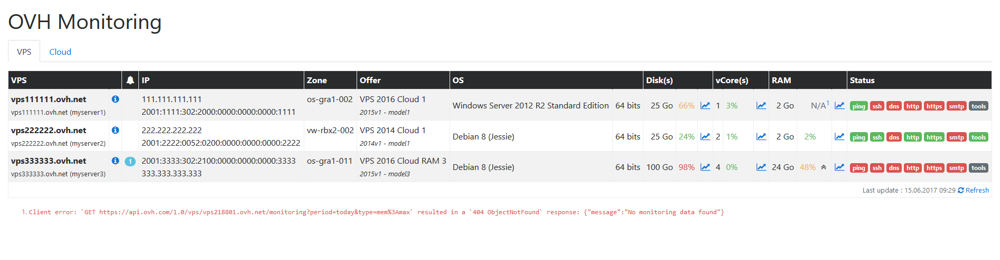

[](https://hub.docker.com/r/jbelien/ovh-monitoring/)
[](https://hub.docker.com/r/jbelien/ovh-monitoring/)
[](https://scrutinizer-ci.com/g/jbelien/OVH-Monitoring/?branch=master)
[](https://scrutinizer-ci.com/g/jbelien/OVH-Monitoring/build-status/master)

# OVH-Monitoring

OVH VPS/Cloud Monitoring via [OVH API](https://api.ovh.com/) using PHP.



## Configuration

### First step

Create credentials : <https://api.ovh.com/createToken/index.cgi?GET=/vps*&GET=/cloud*&GET=/status*>

### Second step

Create `monitoring.ini` file :

```
application_key    = your_application_key
application_secret = your_application_secret
endpoint           = ovh-eu
consumer_key       = your_consumer_key
```

-----

## Install using Composer

### First step

```
composer create-project jbelien/ovh-monitoring
```

### Second step

Create `monitoring.ini` file next to `public` directory (see [Configuration](#configuration)).

## Install using Docker

### First step

Build image from [GitHub](https://github.com/jbelien/OVH-Monitoring):
```
docker build --rm -t jbelien/ovh-monitoring https://github.com/jbelien/OVH-Monitoring.git
```

**OR**

Pull image from [Docker Hub](https://hub.docker.com/r/jbelien/ovh-monitoring/):
```
docker pull jbelien/ovh-monitoring
```

### Second step

Create `monitoring.ini` file (see [Configuration](#configuration)).

### Third step

Run Docker container with your `monitoring.ini` mount as volume:

```
docker run --rm -p 80:80 -v "$PWD/monitoring.ini:/var/www/html/monitoring.ini" jbelien/ovh-monitoring
```

**Warning:** You maybe will have to fix the path to `monitoring.ini` file (replace `$PWD/monitoring.ini` by the correct path).

### Fourth step

Go to http://myserver/ (using port `80`) where `myserver` is the IP address of your server to have a look a the monitoring tool.
